### Notable professional contributions

- [Ceres](https://github.com/racker/ceres): Simple multi-dimensional, time-series datastore backed by Cassandra with continuous downsampling
- [Salus](https://github.com/racker/salus-telemetry-bundle): Cloud-scale, multi-tenant monitoring solution with remote provisioning of 3rd party collectors
- [go-restclient](https://github.com/racker/go-restclient): Provides a higher-order Go type that simplifies calling REST APIs
